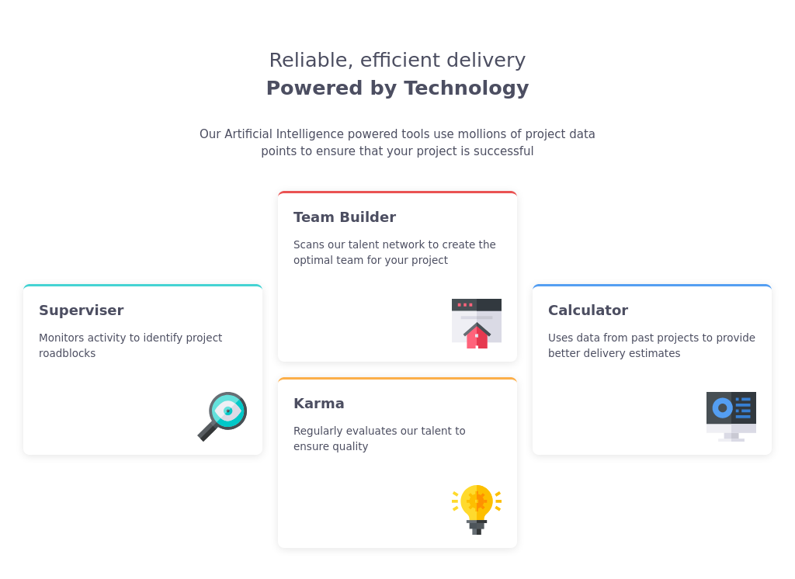
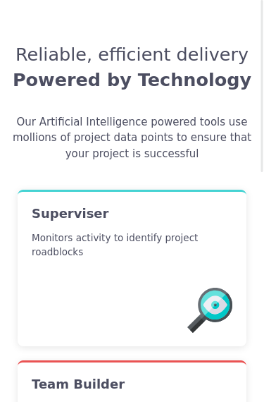

# Frontend Mentor - Four card feature section solution

This is a solution to the [Four card feature section challenge on Frontend Mentor](https://www.frontendmentor.io/challenges/four-card-feature-section-weK1eFYK). Frontend Mentor challenges help you improve your coding skills by building realistic projects. 

## Table of contents

- [Overview](#overview)
  - [The challenge](#the-challenge)
  - [Screenshot](#screenshot)
  - [Links](#links)
- [My process](#my-process)
  - [Built with](#built-with)
  - [What I learned](#what-i-learned)
  - [Continued development](#continued-development)
  - [Useful resources](#useful-resources)
- [Author](#author)

## Overview

### The challenge

Users should be able to:

- View the optimal layout for the site depending on their device's screen size

### Screenshot

#### Desktop

#### Mobile

### Links

- Solution URL: [Github](https://github.com/AK-CHP1/fm_four_card_feature_section)
- Live Site URL: [Github Pages](https://ak-chp1.github.io/fm_four_card_feature_section/)

## My process

### Built with

- Semantic HTML5 markup
- CSS custom properties
- CSS Grid

### What I learned

In this challenge I learnt about CSS grid and advanced floating concepts like `display: flow-root` which a container to completely contain the floating element.

### Continued development

This project still needs to fix box shadows for the feature cards

### Useful resources

- [MDN article on floats](https://developer.mozilla.org/en-US/docs/Learn/CSS/CSS_layout/Floats) - This article taught me about `display: flow-root` which helps the container of a floating element to completely wrap it so that the element following the container doesn't start wrapping itself around the floating element

## Author

- Name - Aayush Kumar
- Frontend Mentor - [@ak-chp1](https://www.frontendmentor.io/profile/ak-chp1)
